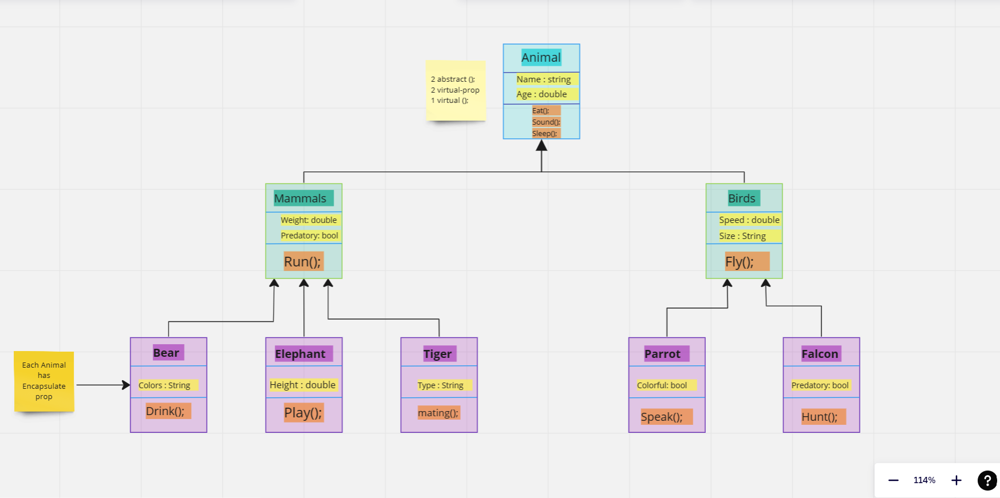
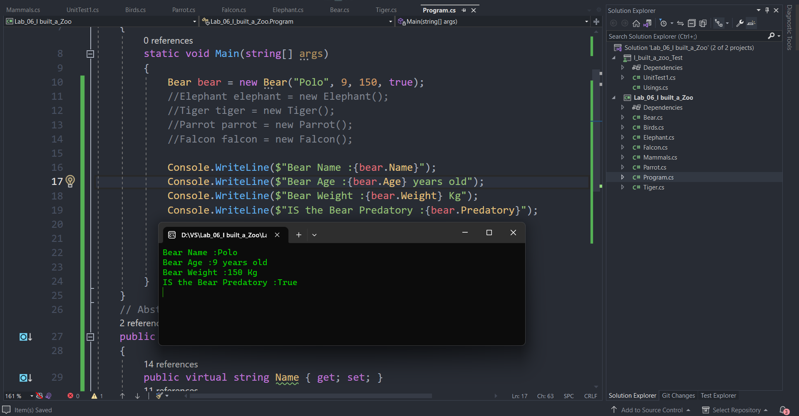
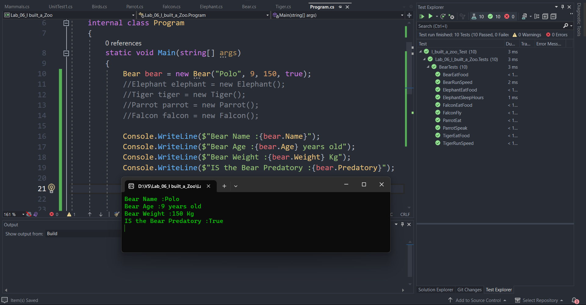

# I built a Zoo! 🌿✨
### [You can check lab07 from HERE](https://github.com/alharet7/Lab_06_I-built_a_Zoo/blob/master/README07.md)
- In this project, I built a zoo with a base class Animals, after that, I built two classes inherit from the base class first one is Mammals and the second one is birds. In the Mammals class. I put three animals that are inherited from the Mammals class and from the Animals class and in the Birds class I put two birds, a Parrot, and a Falcon, and each of them is Inherent from the Birds class and Animals class.
---

## Digital UML drawing of my zoo

---

## Technical documentation

[Click here to Check my Technical documentation](https://github.com/alharet7/reading-notes/blob/main/Read-classes/Read-class06%3AOOP.md)

---
- I used in my project all of the OOP Principles. The inheritance, Abstraction, Encapsulation, And polymorphism. I use inheritance to inherit Properties and methods from the base class Animals to the derived class Mammals and the third class animal (ex: Bear), I used encapsulation for each animal to encapsulate Its property.

- Passed all tests ✅

