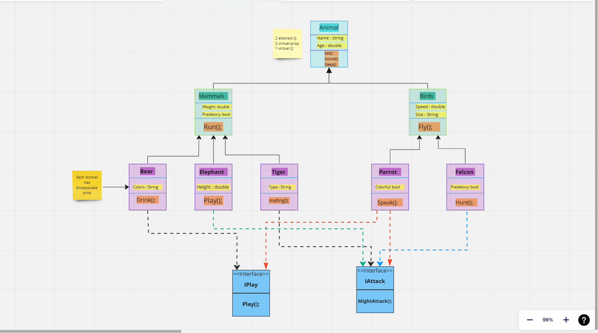
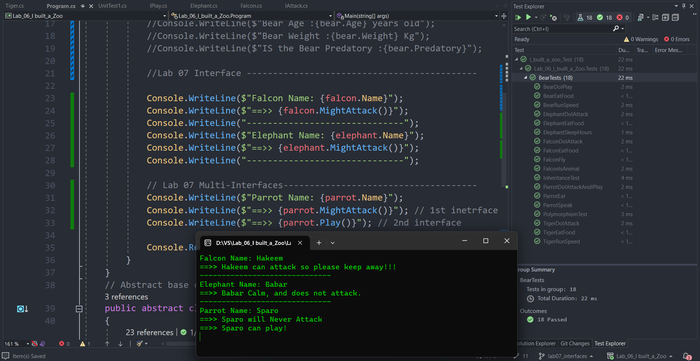

# I built a Zoo part two! 🌿✨

## Lab07 - Interfaces

- We can say the interface is a ***contract*** that defines the behavior of a **class** or **struct**. It contains ***only the declaration of members***, such as methods, properties, events, and indexers, but not their implementation. The implementation is provided by the class or struct that implements the interface.[READ MORE](https://learn.microsoft.com/en-us/dotnet/csharp/language-reference/keywords/interface)
---
- In this lab, I used the Interface topic to make concrete animals inherit from more than one class.
- Each interface is created and implemented by more than one class.
- one class implemented more than one interface(Parrot class).
- Passed all tests ✅

### UML UPDATE:

### CODE UPDATE:

